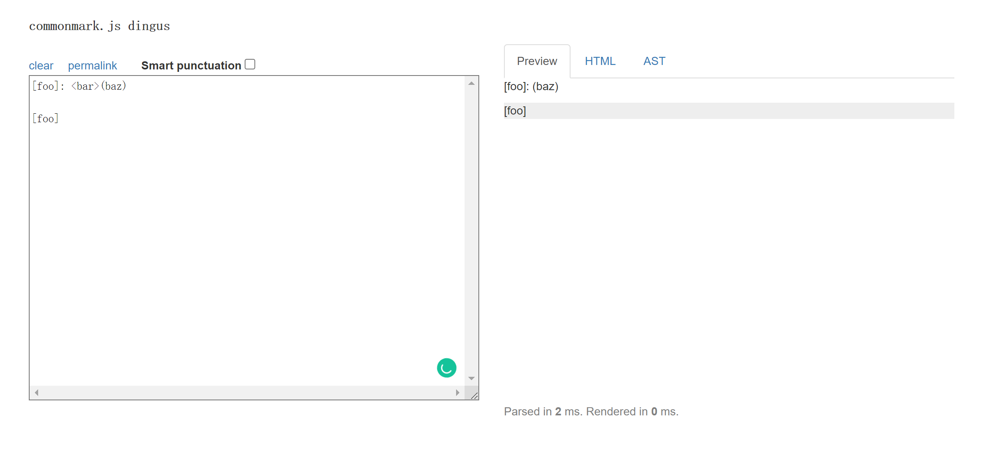
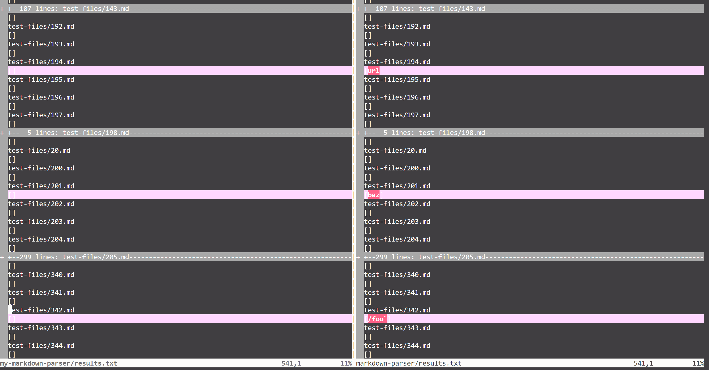

# Welcome to Anthony's Lab Report 5

In this report, I would like to show you how I managed to find and evaluate two bugs using bash script. 

## Using Bash Script to Store and Compare Different Results  

* Firstly, I cloned the updated version of Markdown-parser using `git clone https://github.com/nidhidhamnani/markdown-parser.git cse15lsp22-markdown-parser` command.  

* After using `vim` to get into the _script.sh_ file, I inserted the command `echo` which prints the filename of each file in the _test-files_ folder, before running the test.  

  

* Then I used `bash script.sh > results.txt` command to store all the results into a txt file. Then use `cat results.txt` to check the contents.  


* To comparing different results of test cases, I cloned my own implementation of markdown-parser using `git clone https://github.com/Ayditore/markdown-parser.git (my markdown parese repo http) my-markdown-parser` command.

* Then, I copied the test-files folder and the script.sh to my implementation folder using the following command

```
cp -r test-files my-markdown-parser/
cp cse15lsp22-markdown-parser/script.sh my-markdown-parser/
```

* Then, I ran scrpit bash commands again and stored the new test results into _results.txt_ in _my-markdown-parser_ folder.

* We then compare these two txt files using the command of `vimdiff`, and we can see the different results due to different implementations of markdown-parser:


* Based on the `vimdiff` command result, I picked _194.md_ and _201.md_ to be the two bugs that will be evaluated in the following section.

---

## Links to the testing case 
[**Link to 194.md testing case**](https://github.com/nidhidhamnani/markdown-parser/blob/main/test-files/194.md)

[**Link to 201.md testing case**](https://github.com/nidhidhamnani/markdown-parser/blob/main/test-files/201.md)

---

## The expalantion on _194.md_


* Expected 0utput of _194.md_

    The expected output of 194.md can be checked by using [Commanmark website](https://spec.commonmark.org/dingus/)

    


* Which one is correct

    By using `vimdiff` command, I found the difference between the result of my implementation and the result produced by latest shared markdown implementation on the test of _194.md_.

    

    According to the preview, the latest shared version has the correct implementation, as it should output `[url]`. And my own implementation is incorecct as it output a empty result.

* Describe the bug

    I think the reason why the shared version passes the test because it uses the `Map` interface to facilitate `getLinks` method. After it gets a pair of brackets, the program will continue to find the next and first-appeared open and closing parentheses in the same line, if not found, return `[]`, if found, return the link inside the parentheses, therefore the shared version can return the correct output as expected.

* Where can I fix it

    For my implementation, previously I didn't consider too much on this situation, so the bug is that my program automatically filtered this test case to "no link" cases. I think improvement and modification can be made in the while loop in the `getLinks` method. I can add more condition on different if statements to make no influence when there is different characters and symbols between the first pair of brackets and the first pair of parentheses.

    

---

## The expalantion on _194.md_
The expected output of 194.md can be checked by using [Commanmark website](https://spec.commonmark.org/dingus/)



* Then, by using `vimdiff` command, I found the difference between the result of my implementation and the .



* According to the preview that we saw, the latest shared version has the correct implementation but my implementation is not, as it should output `[url]`.

* I think the reason why the shared version passes the test because it uses the `Map` interface to carry out the method of `getLinks`. After it gets a pair of brackets, the program will continue to find the next and first-appeared open and closing parentheses in the same line, if not found, return `[]`, if found, return the link inside the parentheses, therefore the shared version can return the correct output as expected.

* For my implementation, previously I didn't consider too much on this situation, so the bug is that my program automatically filtered this test case to "no link" cases. I think improvement and modification can be made in the while loop in the `getLinks` method. I can add more condition on different if statements to make no influence when there is different characters and symbols between the first pair of brackets and the first pair of parentheses.