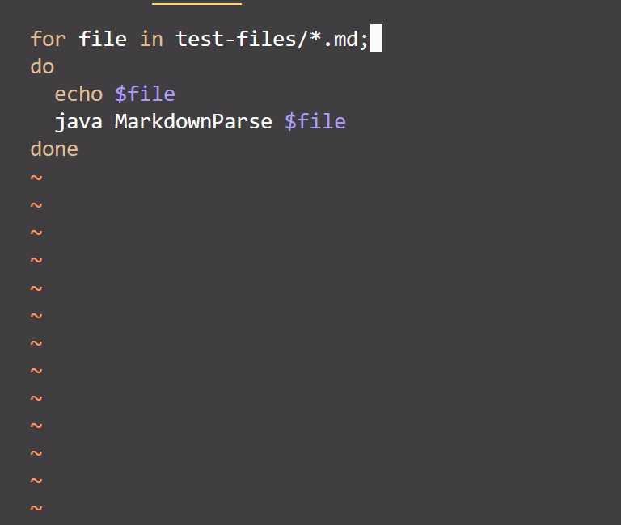
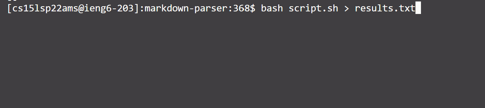
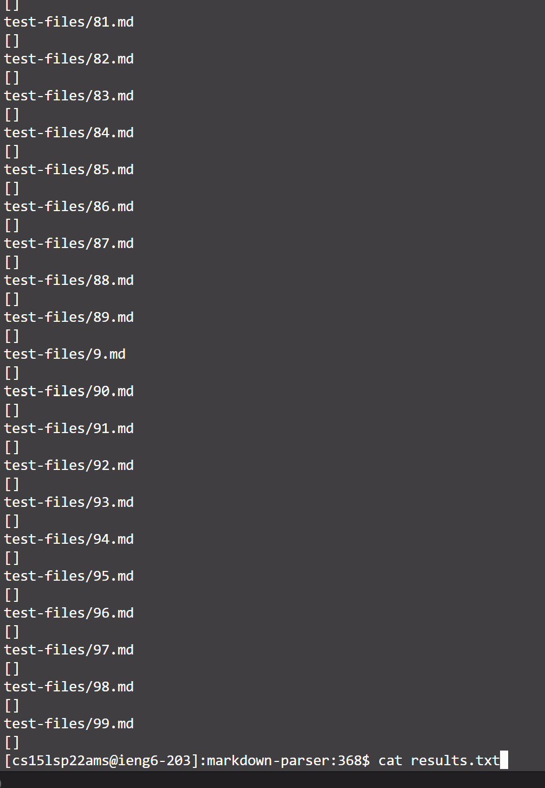
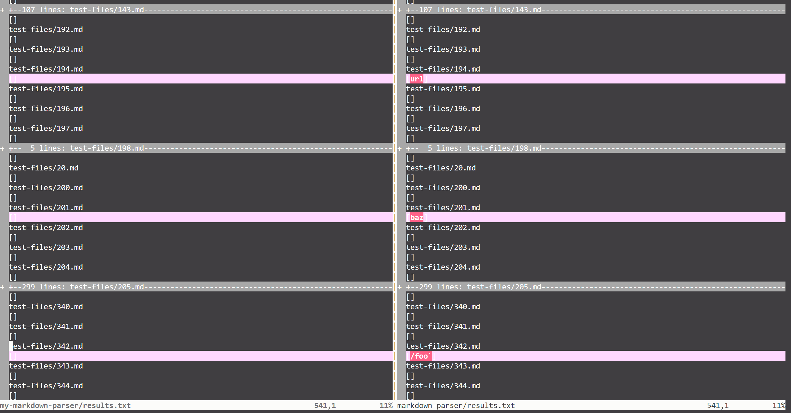
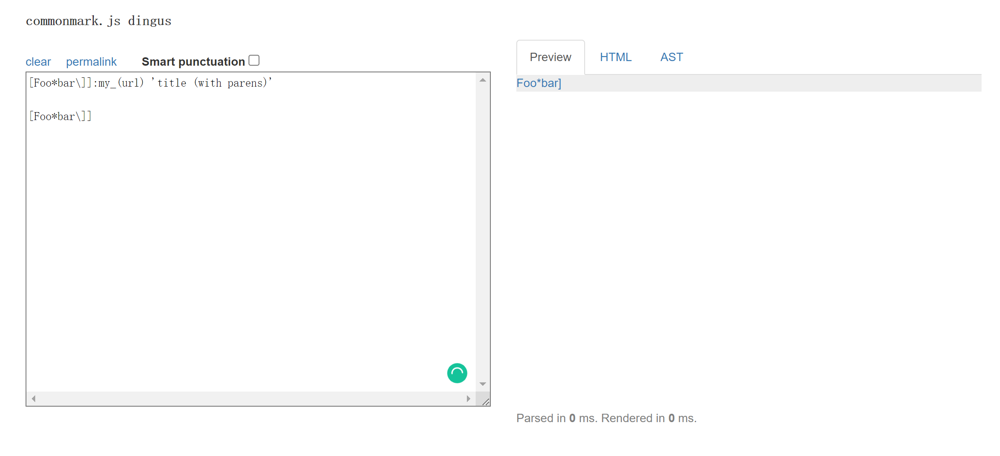
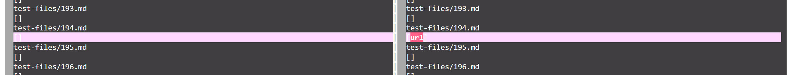
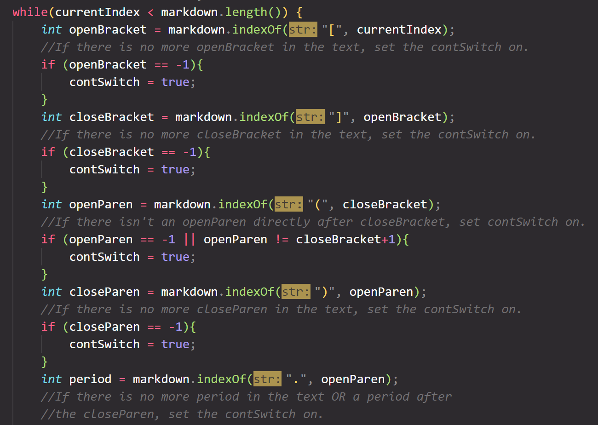
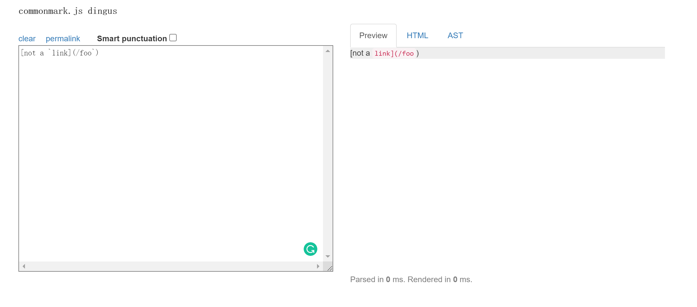
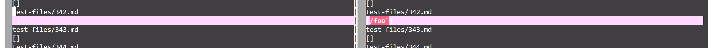
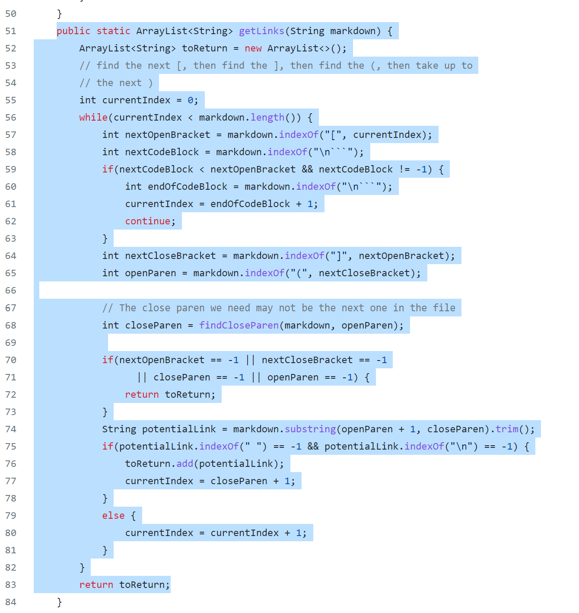

# Welcome to Anthony's Lab Report 5

In this report, I would like to show you how I managed to find and evaluate two bugs using bash script. 

---

## Using Bash Script to Store and Compare Different Results  

    Firstly, I cloned the updated version of Markdown-parser using `git clone https://github.com/nidhidhamnani/markdown-parser.git cse15lsp22-markdown-parser` command.  

    After using `vim` to get into the _script.sh_ file, I inserted the command `echo` which prints the filename of each file in the _test-files_ folder, before running the test.  

      

    Then I used `bash script.sh > results.txt` command to store all the results into a txt file. Then use `cat results.txt` to check the contents.  

    

    

    To comparing different results of test cases, I cloned my own implementation of markdown-parser using `git clone https://github.com/Ayditore/markdown-parser.git (my markdown parese repo http) my-markdown-parser` command.

    Then, I copied the test-files folder and the script.sh to my implementation folder using the following command

    ```
    cp -r test-files my-markdown-parser/
    cp cse15lsp22-markdown-parser/script.sh my-markdown-parser/
    ```

    Then, I ran scrpit bash commands again and stored the new test results into _results.txt_ in _my-markdown-parser_ folder.

    Then compare these two txt files using the command of `vimdiff`, and we can see the different results due to different implementations of markdown-parser:

    

    Based on the `vimdiff` command result, I picked _194.md_ and _342.md_ to be the two bugs that will be evaluated in the following section.

---

## Links to the testing case 
[**Link to 194.md testing case**](https://github.com/nidhidhamnani/markdown-parser/blob/main/test-files/194.md)

[**Link to 342.md testing case**](https://github.com/nidhidhamnani/markdown-parser/blob/main/test-files/342.md)

---

## The expalantion on _194.md_

* **Expected 0utput of _194.md_**

    The expected output of 194.md can be checked by using [Commanmark website](https://spec.commonmark.org/dingus/)

    


* **Which one is correct**

    By using `vimdiff` command, I found the difference between the result of my implementation and the result produced by latest shared markdown implementation on the test of _194.md_.

    

    According to the preview, the latest shared version has the correct implementation, as it should output `[url]`. And my own implementation is incorecct as it output a empty result.

* **Describe the bug and Where can I fix it**

    I think the bug in my implementationi is caused by the problem which the `if` statements filter this case to the "no link" cases which finally output a empty result. I think the bug can be fixed by improving the while loop in `getLinks` method. I can add more condition on if statements to make sure the different characters and symbols between the first pair of brackets and the first pair of parentheses does not affect the output.

    

    The screen shot shows my implementation of the if statements to find brakets and parenthesis. I think I can improve my code in this section to fix the bug.

---

## The expalantion on _342.md_

* **Expected 0utput of _342.md_**

    The expected output of _342.md_ can be checked by using [Commanmark website](https://spec.commonmark.org/dingus/)

    

* **Which one is correct**

    By using `vimdiff` command, I found the difference between the result of my implementation and the result produced by latest shared markdown implementation on the test of _342.md_.

    

    According to the preview, my own version the correct implementation, as it should output `[]`, an empty result. And the latest shared version implementation is incorecct as it output a non-empty result.

* **Describe the bug and Where can I fix it**

    For the latest shared version of Markdown-parser, the bug appeared because there is a pair of in-line code symbol containg the closing braket and opening parenthesis. Since the pair of in-line code symbol makes the content within the symbol becomes in-line code, this case should not be considered as a link and the output should be empty. But the latest shared version did not filter it successfully. Some modification can be made in the implementation of the `getLinks` method. In the while loop, we can add an additional condition to identify and solve the situation when specific symbols like the in-line code symbol pair appears between the brackets or parentheses. When specific characters are detected, the output should directly not include any links from the current line in the file.

    